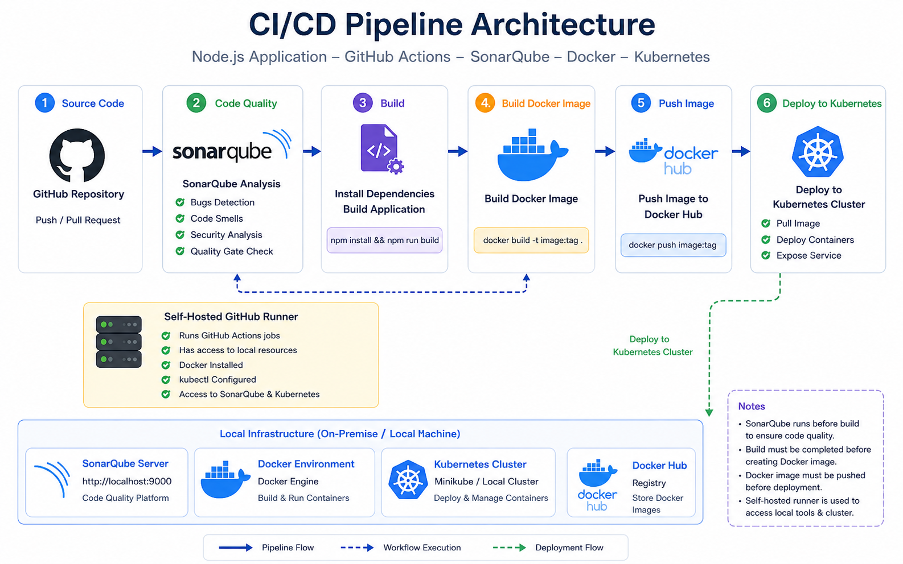

# 🚀 Node.js CI/CD Pipeline with GitHub Actions, Docker, SonarQube & Kubernetes

This project demonstrates a complete DevOps CI/CD pipeline for a Node.js application using modern tools and local infrastructure.

---

## 📌 Project Overview

This project implements an end-to-end CI/CD pipeline that includes:

* Application containerization using Docker
* Automated CI/CD using GitHub Actions
* Code quality analysis using SonarQube
* Deployment to a Kubernetes cluster (Minikube)
* Fully automated build, push, and deployment process

---

## 🧱 Tech Stack

* Node.js
* Docker
* GitHub Actions
* Kubernetes (Minikube Cluster)
* SonarQube
* Self-hosted GitHub Runner

---

## 📁 Project Structure

```
.
├── k8s/
│   ├── deployment.yml
│   ├── nodejs-service.yml
│   ├── mysql-service.yml
│   ├── statefulset.yml
│   ├── pvc.yml
│   ├── pv.yml
│   ├── secret.yml
│   └── namespace.yml
├── Dockerfile
├── package.json
├── app.js
└── .github/workflows/
    └── main.yml
```

---

## 🏗️ Architecture

<p align="center">
  
</p>

> This architecture shows the full CI/CD pipeline from code commit to Kubernetes deployment using a self-hosted runner.

---

## ⚙️ CI/CD Pipeline Flow

The pipeline is triggered on:

* Push to `master`
* Pull Requests to `master`

### Pipeline Stages:

1. **Checkout Code**
2. **Run SonarQube Analysis (Code Quality - QA Stage)**
3. **Build Application**
4. **Build Docker Image**
5. **Push Image to Docker Hub**
6. **Deploy to Kubernetes Cluster**

---

## 🧪 SonarQube Setup

SonarQube is running locally using Docker:

```bash
docker run -d -p 9001:9000 sonarqube
```

Access SonarQube at:

```
http://localhost:9001
```

### Used for:

* Bug detection
* Code smells
* Security analysis
* Quality gate validation

---

## 🐳 Docker

### Build Image

```bash
docker build -t <your-dockerhub-username>/nodejs-app .
```

### Run Container

```bash
docker run -p 3000:3000 <your-dockerhub-username>/nodejs-app
```

---

## ☸️ Kubernetes Deployment

Apply all manifests:

```bash
kubectl apply -f k8s/
```

Check resources:

```bash
kubectl get pods
kubectl get svc
```

---

## 🧠 Why Self-Hosted Runner?

A self-hosted runner was used because:

* No cloud infrastructure available
* Needed access to local services (SonarQube & Kubernetes)
* Full control over execution environment
* Ability to run Docker and kubectl locally

---

## ⚠️ Challenges & Solutions

### 1. SonarQube Connection Issue

* Problem: `localhost` not accessible inside Docker container
* Solution: Used host IP instead of localhost

---

### 2. Kubernetes Connection Error

* Problem: `no route to host`
* Solution: Ensured Minikube is running and kubeconfig is correctly configured

---

### 3. Self-hosted Runner Issues

* Problem: runner not picking jobs or failing
* Solution: ensured runner is running using:

```bash
./run.sh
```

---

## 📌 Notes

* SonarQube must be running before starting the pipeline
* Kubernetes cluster must be active (Minikube)
* Docker must be installed on the runner machine

 
 
